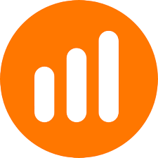

# 🚀 TradeSmart (open-in-v0)

   

<div align="center">
  
  <h1 style="font-family: 'Montserrat', sans-serif; font-weight: 700;">TradeSmart</h1>
  <p>Plataforma moderna de trading automatizado, con UI animada, gestión de riesgo y soporte multilenguaje.</p>
</div>

---

## ✨ Características principales

- 🧑‍💻 **Dashboard de Trading**: Control total de bots, métricas y ejecución.
- 🛡️ **Gestión de Riesgo**: Objetivos, checklist, sliders y configuración avanzada.
- 🔔 **Notificaciones**: Alertas visuales para operaciones y eventos clave.
- 🌐 **Multilenguaje**: Español 🇪🇸 e inglés 🇺🇸, con persistencia automática.
- 🌗 **Tema claro/oscuro**: Personalización global, con fuente Montserrat.
- 🎨 **UI Animada**: Motion, Radix UI, efectos y componentes visuales.
- 🦾 **Bot flotante**: Control de ejecución siempre visible, sin tapar el footer.
- 🦄 **Footer global**: Créditos y enlaces, traducido dinámicamente.

---

## 🗂️ Estructura del Proyecto

| Carpeta/Archivo         | Descripción                                                      |
|------------------------|------------------------------------------------------------------|
| `/app`                 | Entrypoint, layout global, página principal, estilos globales     |
| `/components`          | Componentes UI, tabs, pantallas, animate-ui, utilidades          |
| `/components/ui`       | Elementos visuales reutilizables (botones, tablas, inputs, etc.) |
| `/components/screens`  | Pantallas principales: login, dashboard, selección de broker      |
| `/components/tabs`     | Tabs de Trading, Gestión de Riesgo, Martingala                   |
| `/public`              | Imágenes, logos, recursos estáticos                              |
| `/styles`              | Tailwind, fuentes, estilos globales                              |
| `/hooks`               | Custom hooks para lógica de UI y notificaciones                  |
| `/lib`                 | Utilidades generales                                             |

---

## 🖥️ Demo visual

<div align="center">
  
  <br/>
  
</div>

---

## ⚡ Instalación rápida

```bash
# 1. Clona el repositorio
$ git clone https://github.com/tuusuario/open-in-v0.git
$ cd open-in-v0

# 2. Instala dependencias
$ pnpm install

# 3. Ejecuta en modo desarrollo
$ pnpm dev
```

---

## 🛠️ Scripts útiles

- `pnpm dev` — Entorno de desarrollo
- `pnpm build` — Compilación para producción
- `pnpm start` — Modo producción
- `pnpm lint` — Linter de código

---

## 🧩 Componentes destacados

- **FloatingExecutionBot**: Bot flotante para ejecutar/parar operaciones.
- **NotificationBell**: Notificaciones animadas de eventos y resultados.
- **RiskManagementTab**: Configuración avanzada de gestión de riesgo.
- **AppFooter**: Footer global, multilenguaje y responsivo.
- **LanguageSelector**: Cambia el idioma global de la app.

```tsx
// Ejemplo de uso de FloatingExecutionBot
<FloatingExecutionBot
  botStatus={botStatus}
  getBotStatusColor={getBotStatusColor}
  getBotStatusText={getBotStatusText}
  onStart={handleStartBot}
  onStop={handleStopBot}
  t={{ startBot: 'Iniciar Bot', stopBot: 'Detener Bot' }}
/>
```

---

## 🎨 Estilo y fuentes
- Fuente principal: [Montserrat](https://fonts.google.com/specimen/Montserrat) (Google Fonts)
- Colores y UI: TailwindCSS, Radix UI, motion/react
- Iconos: [Lucide](https://lucide.dev/icons/)

---

## 📦 Dependencias principales

- **Next.js** `15.2.4`
- **React** `19`
- **TailwindCSS** `3.4.17`
- **motion** (animaciones)
- **Radix UI** (componentes accesibles)
- **lucide-react** (iconos)
- **sonner** (notificaciones)
- **recharts** (gráficas)
- **react-hook-form** (formularios)

---

## 🌍 Multilenguaje y tema
- Cambia idioma y tema desde el dashboard o footer.
- Persistencia automática en `localStorage`.
- Traducción instantánea de UI y footer.

---

## 📸 Personalización visual
- Agrega tu logo en `/public/placeholder-logo.png` o `/public/placeholder-logo.svg`.
- Cambia imágenes de brokers en `/public/iq-options.png`, `/public/trading-view.png`.

---

## ❓ Preguntas frecuentes (FAQ)

### ¿Cómo agrego un nuevo idioma?
1. Añade el idioma en el objeto de traducciones de cada componente.
2. Actualiza el selector de idioma en el dashboard/footer.

### ¿Cómo agrego un nuevo broker?
1. Agrega el logo en `/public`.
2. Añade la opción en el componente de selección de broker.

### ¿Cómo personalizo el tema?
- Modifica los colores en `/styles/globals.css` y usa el selector de tema.

---

## 👨‍💻 Autoría y créditos

Hecho con ♥ por [@Darling.dev](https://github.com/tuusuario) — 2025

---

> ¡Contribuciones, issues y sugerencias son bienvenidas!
